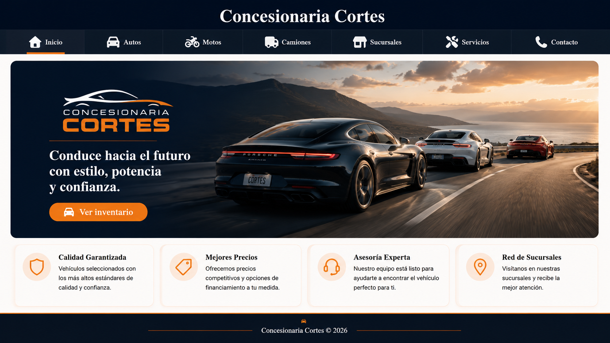
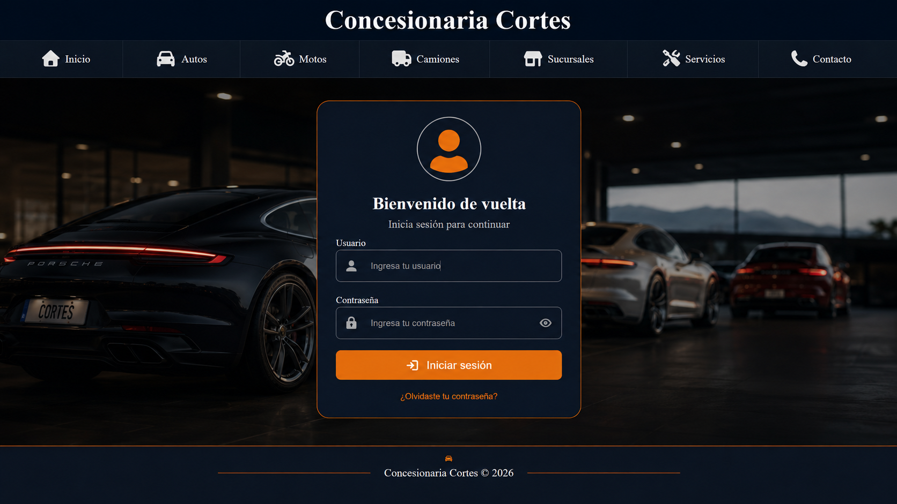
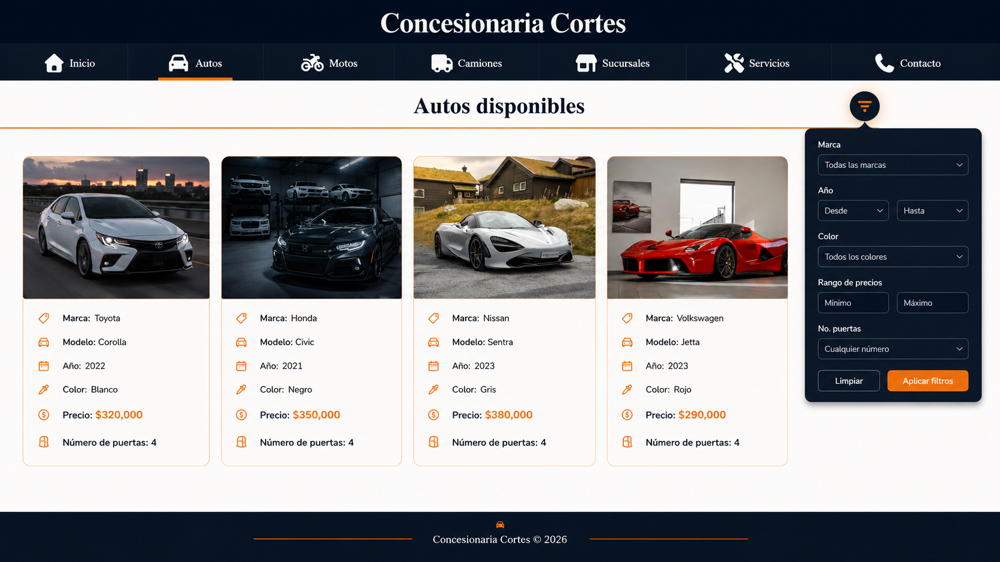
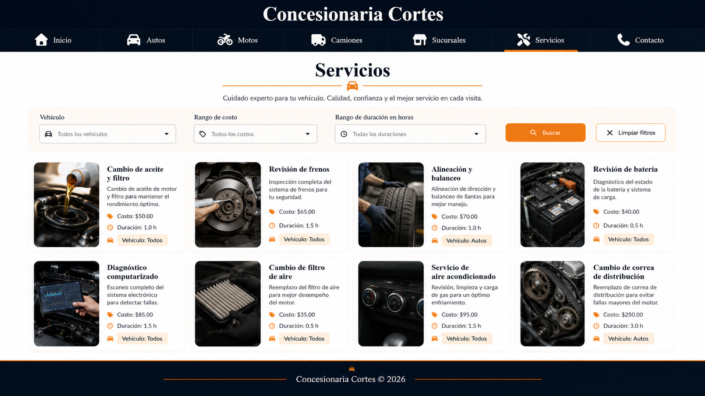
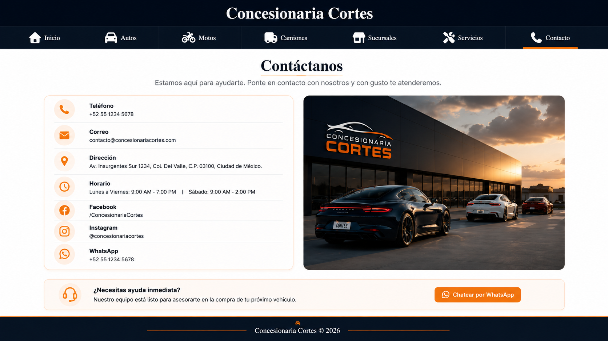

## Documentación

En esta sección se documentan los mockups utilizados, los prompts empleados durante el desarrollo del sitio y el video demostrativo solicitado.

---

## Mockups del sitio

Los siguientes mockups fueron generados como referencia visual antes de finalizar el diseño del sitio **Concesionaria Cortes**.  
Estos mockups ayudaron a definir la estructura general de las páginas, el estilo visual, la navegación, los filtros, las tarjetas y la distribución del contenido.

### Mockup de Inicio



### Mockup de Login



### Mockup de Autos



### Mockup de Servicios



### Mockup de Contacto



---

## Prompt utilizado para generar los mockups

```text
Generame unos mockups de una pagina para un concesionaria de vehiculos sin funcionalidad
```

---

## Prompts utilizados durante el desarrollo

Durante el desarrollo del proyecto se utilizaron distintos prompts para resolver dudas, corregir código y mejorar la implementación del sitio.
---

### Imágenes dinámicas

```text
Genera una función en JavaScript que utilice una API de imágenes para buscar imágenes relacionadas con un tema recibido como parámetro.
```

---

## Video solicitado

El video demostrativo muestra el funcionamiento general del sitio web, incluyendo:

- Navegación entre páginas.
- Inicio de sesión.
- Carga de datos desde archivos XML.
- Generación dinámica de tarjetas.
- Uso de filtros con JavaScript.

**Enlace del video:**

```text
https://youtu.be/DhKvoMKe6fc
```

---
